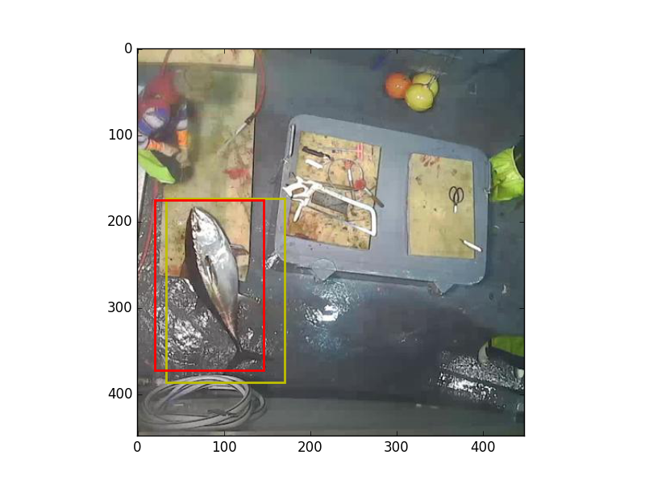
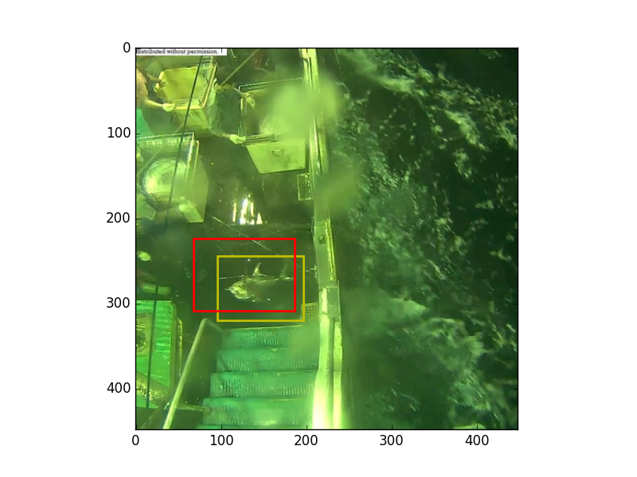
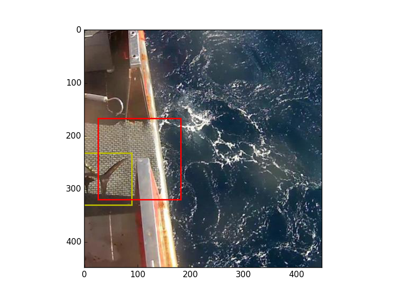
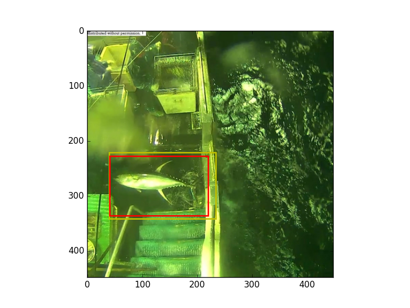
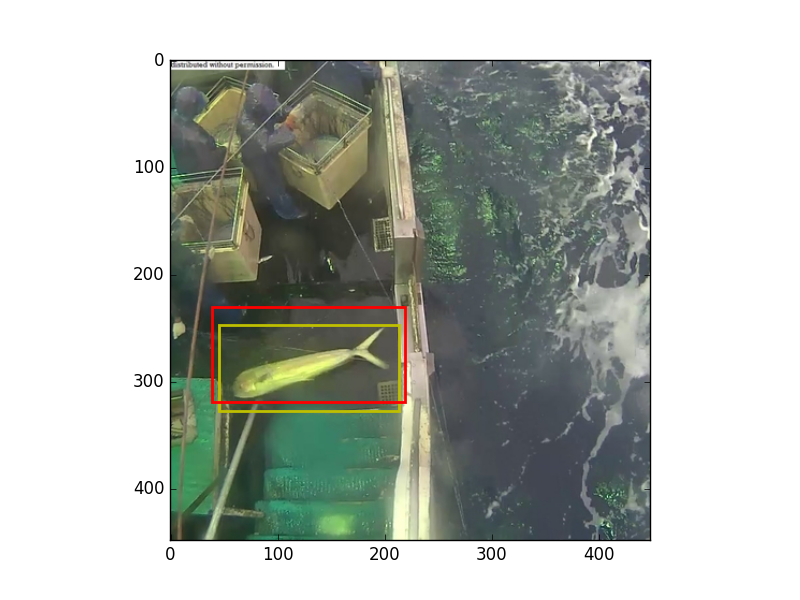
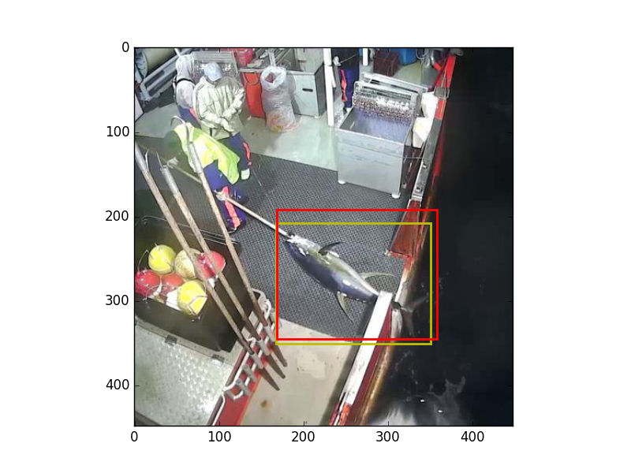
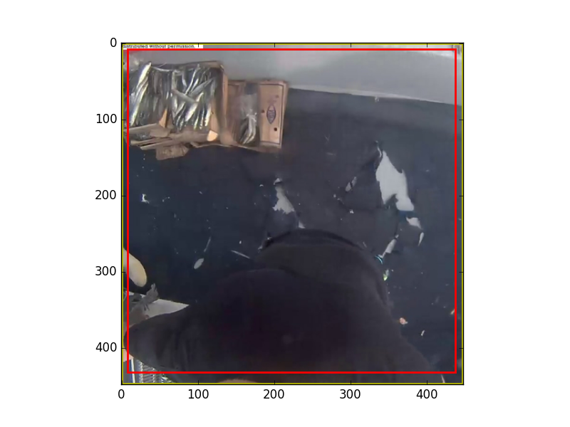
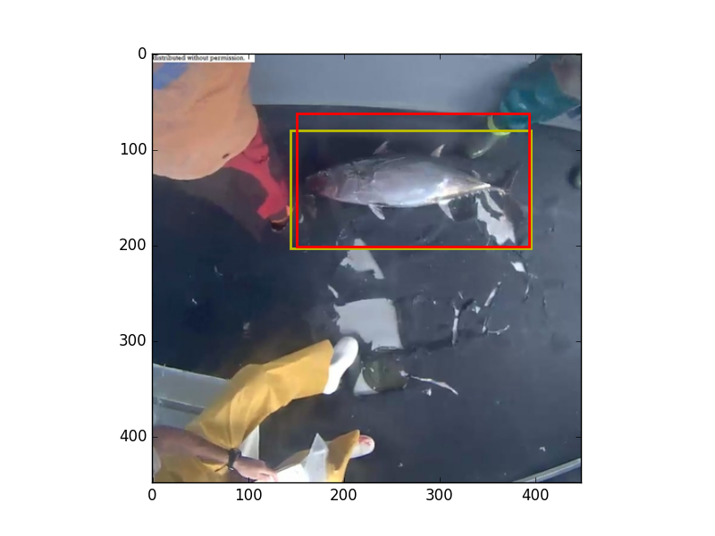
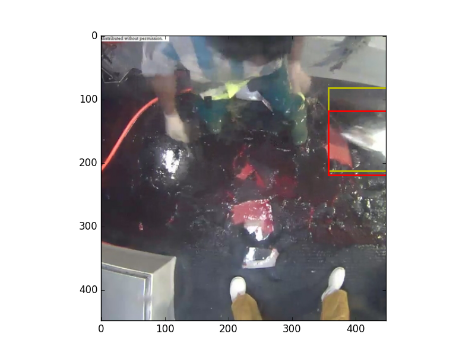
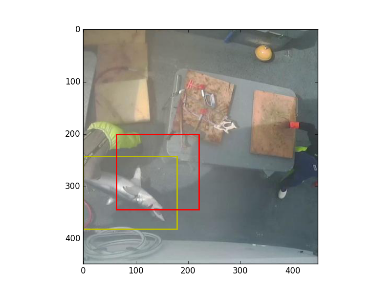

# Kaggle - The Nature Conservancy Fisheries Monitoring

The Conservancy is inviting the Kaggle community to develop algorithms to automatically detect and classify species of tunas, sharks and more that fishing boats catch, which will accelerate the video review process. Faster review and more reliable data will enable countries to reallocate human capital to management and enforcement activities which will have a positive impact on conservation and our planet.

Machine learning has the ability to transform what we know about our oceans and how we manage them. You can be part of the solution.

## Current Proposal

Image -> localization network -> crop -> classification network

### Localization network

Currently a pretrained ResNet-50.

* Trained with MSE
* Output x, y, height, width - normalized to (0,1)
* Uses Adam with staring lr=0.0001 as the optimizer
* 4 sigmoid units for output - network training is better behaved with these units vs linear units (I don't get why).
* If LocNet can't find a fish then it should just return the original image by predicting a fullsize bounding box.

**Ideas to Improve Localization**

1) Try different parameters for network and training. We have a small dataset, overfitting is a problem.
2) We have big differences in the number of examples for each class. Might try oversampling.
3) Try dropout within the ResNet like how wide-ResNets utilize it.
4) ResNet might have too much capacity for such a small dataset. However, preliminary results look good.
5) Inflate all predicted bounding boxes by some amount to allow for error.
6) Force bounding box to be square so that we don't mess up aspect ratio when cropping out fish. Most pretrained networks need input of size 224,224 or 256,256. 

**Current Performance**

