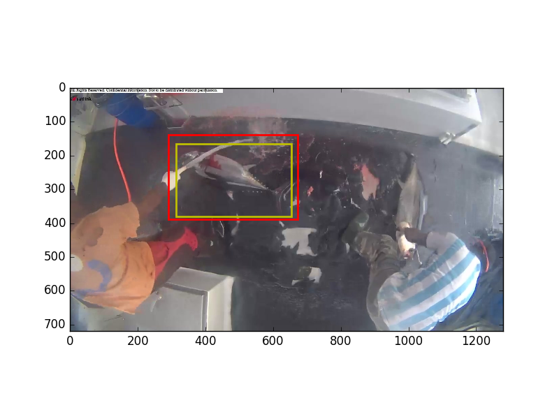
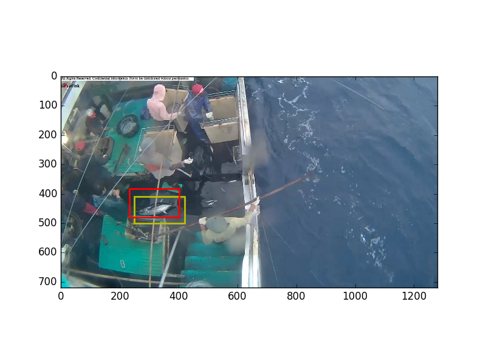
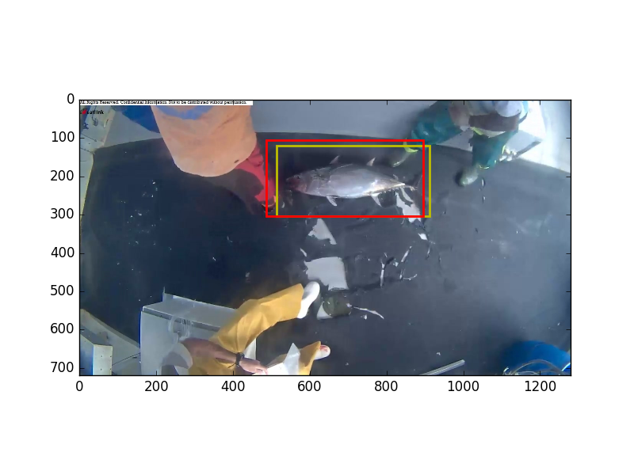
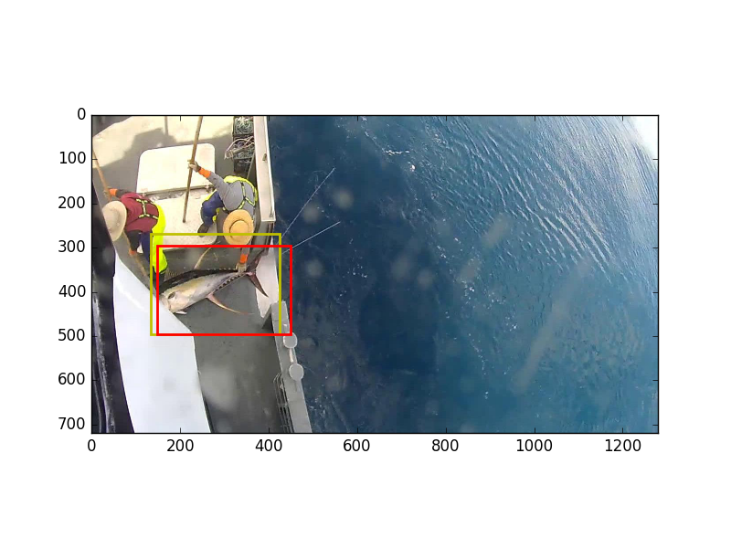
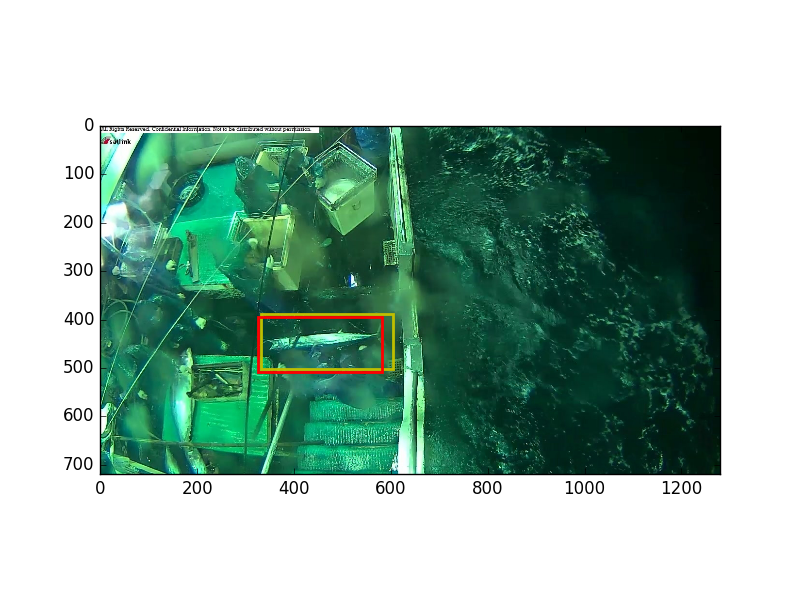
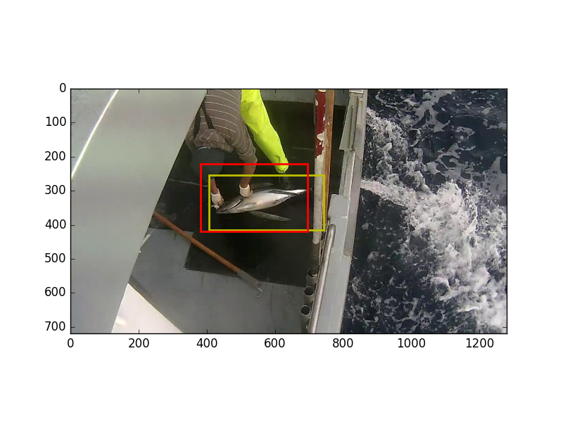
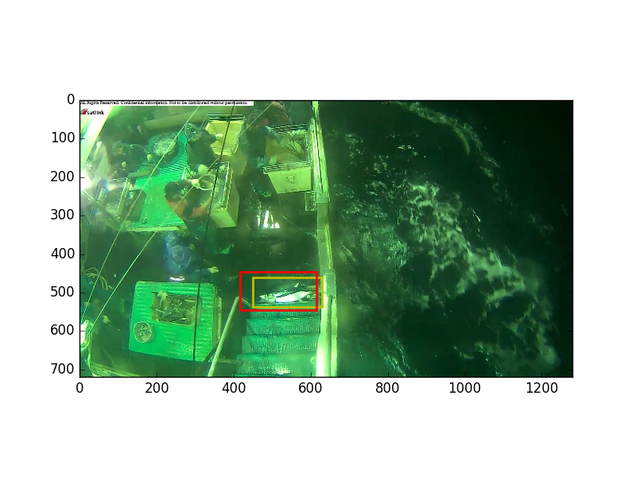
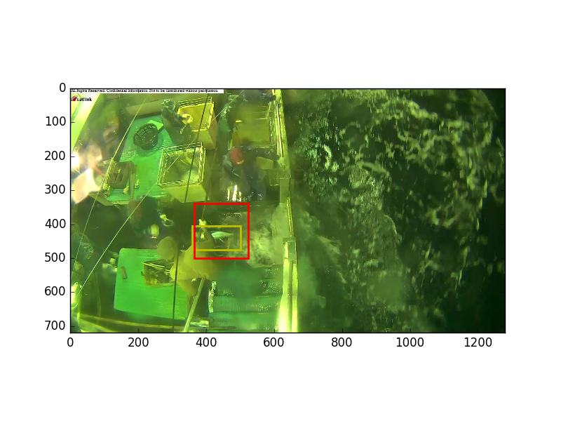
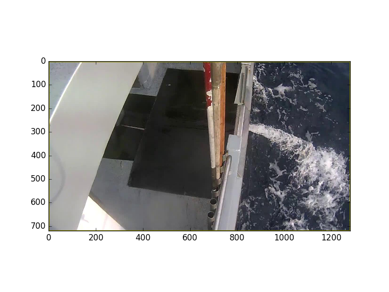

# Kaggle - The Nature Conservancy Fisheries Monitoring

The Conservancy is inviting the Kaggle community to develop algorithms to automatically detect and classify species of tunas, sharks and more that fishing boats catch, which will accelerate the video review process. Faster review and more reliable data will enable countries to reallocate human capital to management and enforcement activities which will have a positive impact on conservation and our planet.

Machine learning has the ability to transform what we know about our oceans and how we manage them. You can be part of the solution.

## Current Proposal

Image -> localization network -> crop -> classification network

### Localization network

Currently a pretrained ResNet-50.

* Trained with MAE
* Output x, y, height, width - normalized to (0,1)
* Uses Adam with staring lr=0.0001 as the optimizer
* 4 sigmoid units for output - network training is better behaved with these units vs linear units.
* If LocNet can't find a fish then it should just return the original image by predicting a fullsize bounding box.

**Ideas to Improve Localization**

* **Synthetic training images**. Manually crop two or three fish from each category from training images. Edit them in Gimp or something so that all non-fish parts of the images are transparent. Take example images from the no fish folders and randomly place one cropped fish image into image from the no-fish folder. One thing that worries me is that the boats will be different for the second stage. Currently there are only a handful of boats and the fish are likely to be in the same place in each boat. Making synthetic training images where the fish can be anywhere in the image could help with generalization.
* Try different parameters for network and training. We have a small dataset, overfitting is a problem.
* Better data augmentation for training bounding boxes. Need to be careful that the bounding boxes will still over the fish. Currently doing horizontal flips and translations, maybe also try scaling.
* Average bounding box for a few networks.
* Test time augmentation for bounding box prediction
* We have big differences in the number of examples for each class. Might try oversampling.
* Try dropout within the ResNet like how wide-ResNets utilize it.
* ResNet might have too much capacity for such a small dataset. However, preliminary results look good.
* Inflate all predicted bounding boxes by some amount to allow for error.
* Force bounding box to be square so that we don't mess up aspect ratio when cropping out fish. Most pretrained networks need input of size 224,224 or 256,256.

**Current Performance**

Red is predicted box and yellow is true box.

 
 
 
 
 
