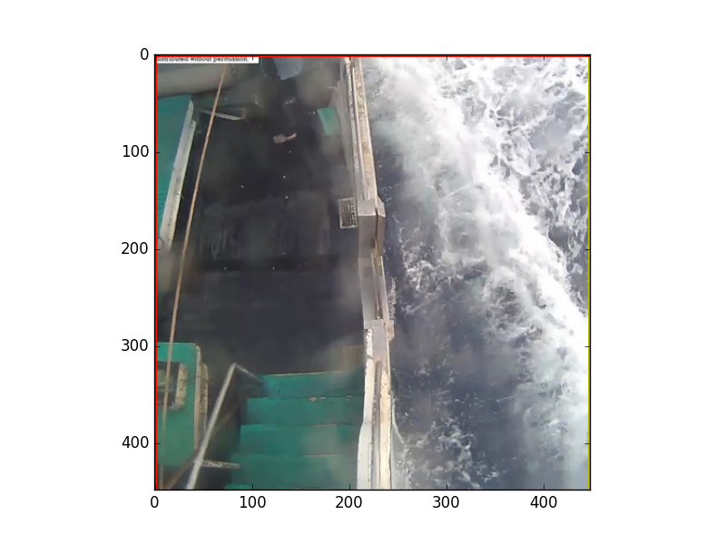
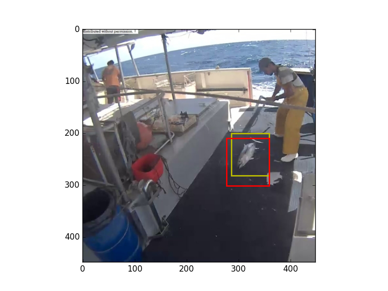
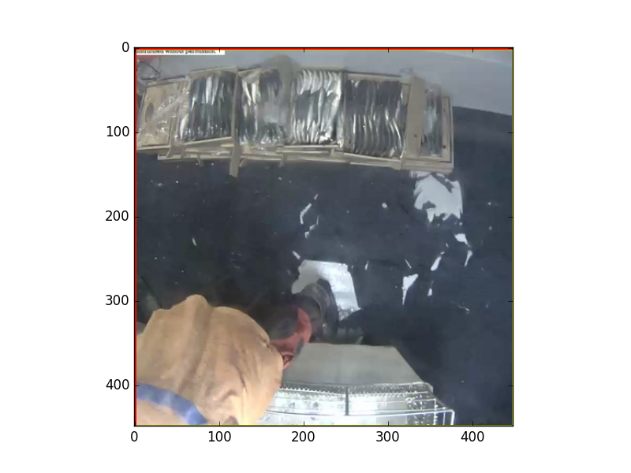
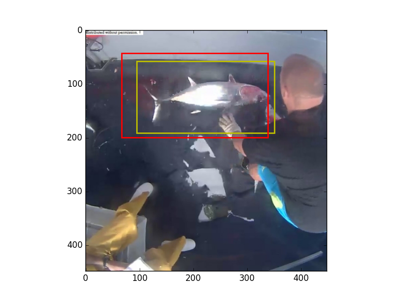
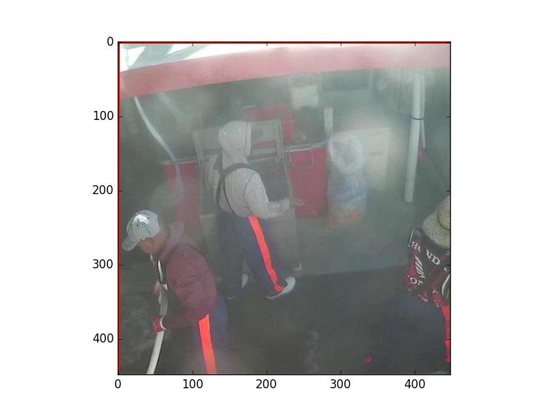

# Kaggle - The Nature Conservancy Fisheries Monitoring

The Conservancy is inviting the Kaggle community to develop algorithms to automatically detect and classify species of tunas, sharks and more that fishing boats catch, which will accelerate the video review process. Faster review and more reliable data will enable countries to reallocate human capital to management and enforcement activities which will have a positive impact on conservation and our planet.

Machine learning has the ability to transform what we know about our oceans and how we manage them. You can be part of the solution.

## Current Proposal

Image -> localization network -> crop -> classification network

### Localization network

Currently a pretrained ResNet-50.

* trained with MSE
* output x,y,height,width - normalized to (0,1)
* uses Adam with staring lr=0.0001 as the optimizer
* 4 sigmoid units for output - network training is better behaved with these units vs linear units (I don't get why).

**Current Performance**

